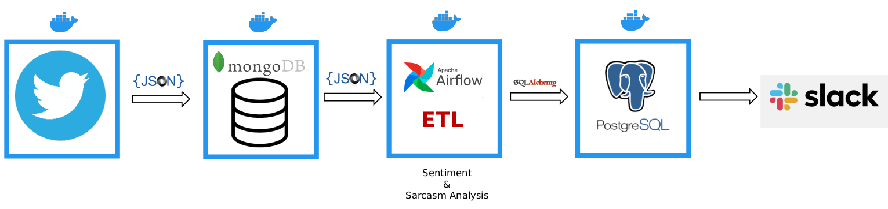

# Tweetbot

## Description
This Dockerized data pipeline extract tweets with given tags from Twitter and store them into **MongoDB** as JSON file. Then, with an **ETL** job maintained on **Airflow** transforms and loads the metadata to **PostGreSQL** database. Tweetbot pipeline also analyzes the sentiment of the tweets via VaderSentiment and checks if the they are sarcastic or not via deployed NLP model. Finally, it posts the sarcastic tweets to a Slack channel.

## Tech used:
- Python
- Airflow
- Docker
- MongoDB
- PostgreSQL
- SQLAlchemy
- pymongo
- VaderSentiment
- SVM
- Slack

## Usage:
1. Install Docker:
`https://docs.docker.com/get-docker/ `

2. Clone this repository: git clone
`https://github.com/Ayazdi/Tweetbot.git`

3. Enter your Twitter and Slack token credentials in the config_example.py and rename it to config.py

4. Go to the main folder of the project in the terminal and run
`docker-compose build $$ docker-compose up`

## Contacts:
https://www.linkedin.com/in/amirali-yazdi-872b5460/

## License
Free software: MIT License
